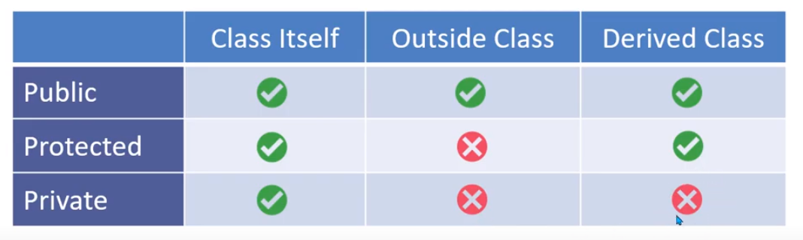

## PHP OOP

## PHP OOP Operator

* object Operator ->
* scope resolution operator ::


## Access Modifier



## Class structure

```php

    class className{
        public $name; //variable

        public function func($a, $b){ //function / method
            return $a + $b;
        }
    }

    $newObj = new className()


```